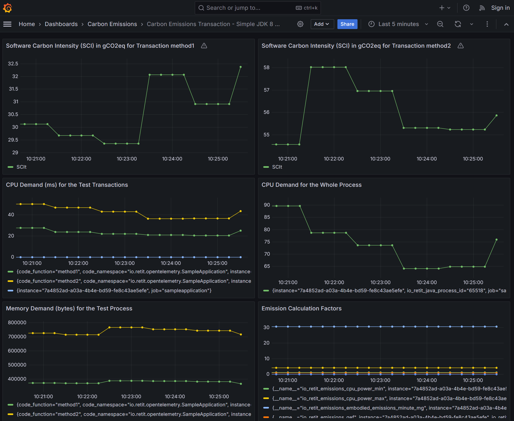

# OpenTelemetry Java Agent Extension to Collect Resource Demand Data and Publish Carbon Emissions


This repository contains an **extension** for the [OpenTelemetry Java Auto-Instrumentation agent](https://github.com/open-telemetry/opentelemetry-java-instrumentation) **to collect resource demand data and to publish carbon emissions**. The following readme assumes that you are already familiar with the basic concepts of [OpenTelemetry](https://opentelemetry.io/) [Traces](https://opentelemetry.io/docs/concepts/signals/traces/) and [Metrics](https://opentelemetry.io/docs/concepts/signals/metrics/), otherwise please read the corresponding documentation first before you continue. 

This Java agent extension attaches 
resource demand data as [Attributes](https://opentelemetry.io/docs/concepts/signals/traces/#attributes) to all [Spans](https://opentelemetry.io/docs/concepts/signals/traces/#spans) captured by the Java Auto-Instrumentation Agent (e.g., API calls), such as storage, network and memory demand in bytes, and CPU demand in milliseconds. You can find an overview of the Span [Attributes](https://opentelemetry.io/docs/concepts/signals/traces/#attributes) added by this extension in the [corresponding section](#opentelemetry-tracing-span-attributes-added-by-this-extension). You can view and analyze these attributes with any compatible OpenTelemetry tracing backend such as [Jaeger](https://www.jaegertracing.io/). If you are interested to automate the analysis of this data of this data please check out our [RETIT Performance Analysis Suite](https://www.retit.io/) which will give you an automated aggregation of these values.

In addition to attaching Span attributes for OpenTelemetry Traces this extension publishes the resource demand data as OpenTelemetry [Metrics](https://opentelemetry.io/docs/concepts/signals/metrics/) for all entry level transactions (e.g., API calls) of an instrumented application. You can find a list of metrics published by this extension in the corresponding [section](#OpenTelemetry-Metrics-published-by-this-extension).  If you are just starting with analyzing the resource demand of your application this is the best starting point for you, before you dig into the span attributes to analyze where exactly the resources are consumed.

Furthermore, the extension follows the [Methodology](https://www.cloudcarbonfootprint.org/docs/methodology/) published by the [Cloud Carbon Footprint (CCF)](https://www.cloudcarbonfootprint.org/) project to calculate the carbon emissions of an instrumented application. It contains data from the [CCF coefficients project](https://github.com/cloud-carbon-footprint/ccf-coefficients) for the biggest clouds (AWS, Azure, and GCP) and their instances. Using the resource demand data and the data of the CCF coefficents allows you to calculate the carbon emissions of single API calls of your application. This is usually done in an OpenTelemetry compatible backend, you can find an example on how this works in the [Demo](#demo) section of this document. If you want to use the extension for your own application check out the [Quickstart](#Quickstart) and [Configuration Options](#configuration-options) section of this document.  

# Quickstart

In order to use the extension with your app you need to attach it to the start command using the -Dotel.javaagent.extensions parameter along with the [OpenTelemetry Java Auto-Instrumentation agent](https://github.com/open-telemetry/opentelemetry-java-instrumentation/blob/main/README.md#getting-started):

```bash
java -javaagent:<replace_with_path>/opentelemetry-javaagent-all.jar \
-Dotel.javaagent.extensions=<replace_with_path>/io.retit.opentelemetry.javaagent.extension.jar \
-jar <your_app>.jar
```
Without any further configuration, the agent including the extension will only publish CPU and memory demand Span attributes and metrics to the default OTLP endpoint on the local machine.

If you also want to capture carbon emission data, you need to at least specify the cloud provider and the region in which your application is operated:

```bash
java -javaagent:<replace_with_path>/opentelemetry-javaagent-all.jar \
-Dotel.javaagent.extensions=<replace_with_path>/io.retit.opentelemetry.javaagent.extension.jar \
-Dio.retit.emissions.cloud.provider=<your_cloud_provider> \
-Dio.retit.emissions.cloud.provider.region=<your_cloud_region> \
-jar <your_app>.jar
```

# Demo

To see the extension in action for a very simple java application we will create the setup depicted in the following image. We will setup an Application that will be instrumented using the OpenTelemetry Java-Agent including our extension. This application will publish resource demand and carbon emission metrics. These metrics will be received by an OpenTelemetry collector which transforms the metrics into a format compatible to Prometheus. Prometheus will fetch the metrics from the collector and store them. Using Grafana, the metrics will be visualized in a preconfigured dashboard.


To build the Sample application you need to run the following maven command:

```bash
./mvnw clean package
```

Afterwards, you can start OpenTelemetry compatible tracing and metrics backends using the following docker command: 

```bash 
docker compose -f ./examples/docker/docker-compose.yml up -d
```

This will start an [OpenTelemetry Collector](https://github.com/open-telemetry/opentelemetry-collector/tree/main) to which the metric and trace data is being sent. Furthermore, it starts [Prometheus](https://prometheus.io/) instance to store the metric data and a [Grafana](https://grafana.com/) instance to visualize the metrics stored in Prometheus. You can optionally also start a [Jaeger](https://www.jaegertracing.io/) instance by commenting out the corresponding section in the docker compose file to visualize the span attributes.

Once the backend is up, the sample Application can then be run with the OpenTelemetry Java agent attached from the root directory as follows.

```bash
java -javaagent:./examples/simple-jdk8-application/target/jib/opentelemetry-javaagent-all.jar \
-Dotel.service.name=sampleapplication \
-Dotel.logs.exporter=logging \
-Dotel.javaagent.extensions=./extension/target/io.retit.opentelemetry.javaagent.extension.jar \
-Dio.retit.emissions.cloud.provider=aws \
-Dio.retit.emissions.cloud.provider.region=af-south-1 \
-Dio.retit.emissions.cloud.provider.instance.type=a1.medium \
-DRUN_MODE=continuously \
-jar ./examples/simple-jdk8-application/target/simple-jdk8-application-0.0.1-SNAPSHOT.jar
```

This application will run until you stop it and generate data. While it is generating data, you can look at the data in the backends. The easiest way is to check out the [Grafana dashboard](http://localhost:3000/grafana/dashboards) here:

    http://localhost:3000/grafana/dashboards

After some time you can see the data produced by this application in the following dashboard. As an example the CPU and memory demands are shown as they are supported on most plattforms as well as the Emission Calculation Factors. Furthermore, we have integrated a [Software Carbon Intensity](https://sci.greensoftware.foundation/) calculation for each transaction based on this data. This calculation is based on our work presented at the [Symposium on Software Performance 2024](https://fb-swt.gi.de/fileadmin/FB/SWT/Softwaretechnik-Trends/Verzeichnis/Band_44_Heft_4/SSP24_16_camera-ready_5255.pdf).



# Configuration Options

As this extension relies on the [OpenTelemetry Java Auto-Instrumentation agent](https://github.com/open-telemetry/opentelemetry-java-instrumentation), you can use all of their configuration options to configure the behaviour of the OpenTelemetry agent. 

Configuration options specific to this extension are listed below. All configurations can be provided as system properties or environment variables, when using system properties they are written lower case with dots, if they are provided as environment variables they are written upper case with "_" as seperator.

| Configuration Option     | Values                                                             | Default | Explanation                                                                                                                          |
|--------------------------|--------------------------------------------------------------------|---------|--------------------------------------------------------------------------------------------------------------------------------------|
| IO_RETIT_LOG_CPU_DEMAND  | true/false                                                         | true    | If set to true CPU demand is captured for every span.                                                                                |
| IO_RETIT_LOG_HEAP_DEMAND | true/false                                                         | true    | If set to true memory demand is captured for every span.                                                                             |
 | IO_RETIT_LOG_DISK_DEMAND | true/false                                                         | false   | If set to true storage demand is captured for every span (Works only on Linux-based systems with a Kernel version higher than 3.14). |
| IO_RETIT_LOG_NETWORK_DEMAND | true/false                                                         | false   | If set to true network demand is captured for every span (Works only on Linux-based systems with a Kernel version higher than 3.14). |
| IO_RETIT_LOG_GC_EVENT | true/false                                                         | true    | If set to true a garbage event listener is registered to capture garbage collection events.                                          |
| IO_RETIT_EMISSIONS_CLOUD_PROVIDER | AWS/Azure/GCP                                                      | -       | Specifies the cloud provider for this process.                                                                                       |
| IO_RETIT_EMISSIONS_CLOUD_PROVIDER_REGION | regions of the corresponding cloud provider                        | -       | Specifies the cloud provider region for this process.                                                                                |
| IO_RETIT_EMISSIONS_CLOUD_PROVIDER_INSTANCE_TYPE | virtual machine instance types of the corresponding cloud provider | -       | Specifies the cloud provider virtual machine instance type for this process.                                                         |
| IO_RETIT_EMISSIONS_STORAGE_TYPE | HDD/SSD                                                            | SSD     | Specifies the storage type for this process.                                                                                         |

# OpenTelemetry Metrics published by this extension

Furthermore, it publishes OpenTelemetry metrics including this data for all entry level transactions (e.g., API calls) of an application. These metrics are called as follows:

    io.retit.resource.demand.storage.bytes
    io.retit.resource.demand.memory.bytes
    io.retit.resource.demand.network.bytes
    io.retit.resource.demand.cpu.ms

If the cloud provider and its region is configured, also emission related metrics are being published:

    io.retit.emissions.cpu.power.min -  minimum power consumption of the CPU in Idle
    io.retit.emissions.cpu.power.max -  maximum power consumption of the CPU at 100% utilization
    io.retit.emissions.embodied.emissions.minute.mg - embodied emissions per minute in mg
    io.retit.emissions.memory.energy.gb.minute -  Memory energy consumption in kWh per GB per minute
    io.retit.emissions.storage.energy.gb.minute - Storage energy consumption in kWh per GB per minute
    io.retit.emissions.network.energy.gb.minute - Network energy consumption in kWh per GB per minute
    io.retit.emissions.pue - Power Usage Effectiveness (PUE) value of the datacenter
    io.retit.emissions.gef - Grid Emissions Factor (GEF)
    
This data can later be used to calculate the carbon intensity of the application or of each API call (e.g., using SCI as shown in our work presented at the [Symposium on Software Performance 2024](https://fb-swt.gi.de/fileadmin/FB/SWT/Softwaretechnik-Trends/Verzeichnis/Band_44_Heft_4/SSP24_16_camera-ready_5255.pdf)).

# OpenTelemetry Tracing Span attributes added by this extension

The span attributes added by this extension are called as follows:

CPU time of the thread processing the Span...:

    io.retit.startcputime           -  ...at Span start time 
    io.retit.endcputime             -  ...at Span end time

Bytes read from storage by the thread processing the Span...

    io.retit.startdiskreaddemand    - ...at Span start time
    io.retit.enddiskreaddemand      - ...at Span end time

Bytes written to storage by the thread processing the Span...

    io.retit.startdiskwritedemand   - ...at Span start time
    io.retit.enddiskwritedemand     - ...at Span end time

Bytes read from network by the thread processing the Span...

    io.retit.startnetworkreaddemand - ...at Span start time
    io.retit.endnetworkreaddemand   - ...at Span end time

Bytes written to the  network by the thread processing the Span...

    io.retit.startnetworkwritedemand-  ...at Span start time
    io.retit.endnetworkwritedemand  -  ...at Span end time

Bytes allocated in memory by the thread processing the Span...

    io.retit.startheapbyteallocation-  ...at Span start time
    io.retit.endheapbyteallocation  -  ...at Span end time

The thread id of the thread processing the Span...

    io.retit.startthread            -  ...at Span start time
    io.retit.endthread              -  ...at Span end time

# Limitations

All resource demand measurements performed by this OpenTelemetry agent extension should only be considered valid, when 
the thread id starting a span (io.retit.startthread) is equivalent to the thread id ending a span (io.retit.endthread). 
In case the thread ids do not match, you cannot use the values for resource demand calculations as the values originate from different sources. This is especially important when running reactive applications or using virtual threads. 
In such a scenario, the extension will only collect spans but will not publish metrics about such measurements. 

When using virtual threads, we are also not able to capture the memory demand of a span at the moment, as this data is
not provided by the JVM yet. Furthermore, for the CPU demand of virtual threads, we are currently working with the assumption that  if a virtual thread was running on the same platform (carrier) thread at span start and end time, we  
can allocate the whole cpu time of the platform thread to the virtual thread (see https://github.com/RETIT/opentelemetry-javaagent-extension/pull/87). 