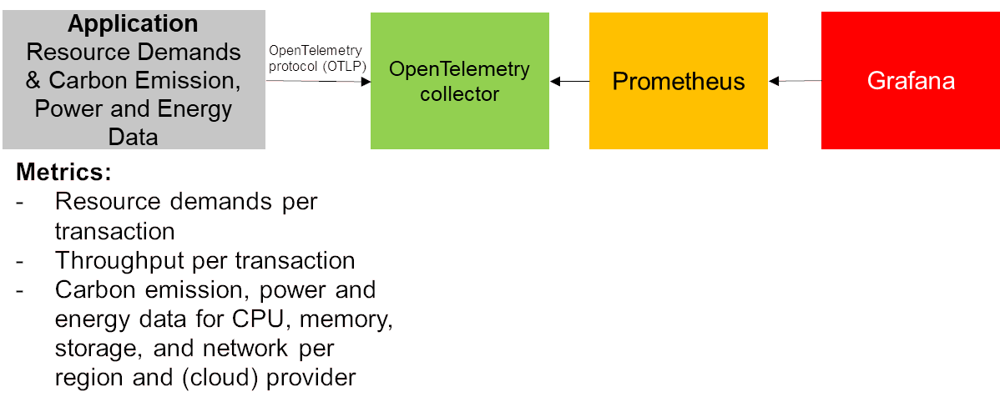

To see the extension in action for a Quarkus-based REST service we will create the setup depicted in the following image. We will setup a Quarkus-Application that will be instrumented using the OpenTelemetry Java-Agent including our extension. This application will publish resource demand and carbon emission metrics. These metrics will be received by an OpenTelemetry collector which transforms the metrics into a format compatible to Prometheus. Prometheus will fetch the metrics from the collector and store them. Using Grafana, the metrics will be visualized in a preconfigured dashboard.

## Please note before you start with the Quarkus-REST sample application:

1. You need to build the whole project before you continue, for details on how to build the project, take a look at the top level [README.md](../../README.md#building-the-project).
2. Afterwards, you need to start OpenTelemetry compatible tracing and metrics backends as explained in the [examples README.md](../README.md#starting-opentelemetry-backends-for-the-example-applications)




Once the preconditions ([building the project and starting the OpenTelemetry backends](#please-note-before-you-start-with-the-jdk8-sample-application))are completed, the Quarkus-based REST-Service application can be started with the OpenTelemetry Java agent attached from the current directory as follows.
```bash
java -javaagent:./target/jib/otel/opentelemetry-javaagent.jar \
-Dotel.service.name=quarkus-app \
-Dotel.logs.exporter=logging \
-Dotel.javaagent.extensions=./target/jib/otel/io.retit.opentelemetry.javaagent.extension.jar \
-Dio.retit.emissions.cloud.provider=aws \
-Dio.retit.emissions.cloud.provider.region=af-south-1 \
-Dio.retit.emissions.cloud.provider.instance.type=a1.medium \
-jar ./target/quarkus-rest-service.jar
```

This application will run until you stop it. Once the service is started, you can issue requests to the following endpoints:

    curl --request GET --url http://localhost:8080/test-rest-endpoint/getData
    curl --request POST --url http://localhost:8080/test-rest-endpoint/postData
    curl --request DELETE --url http://localhost:8080/test-rest-endpoint/deleteData

If you want to automate the execution of these requests, take a look at the following test method in the extension module of the project:

[io.retit.opentelemetry.javaagent.extension.frameworks.quarkus.QuarkusRESTApplicationIT.runTestContinuously](../../extension/src/test/java/io/retit/opentelemetry/javaagent/extension/frameworks/quarkus/QuarkusRESTApplicationIT.java)

When executing this test method, the test will send requests to the Quarkus REST application until you manually stop the tests.

Once you have issued a few requests to one or more of these endpoints you will see the CO2 emissions for each endpoint in Grafana.


The easiest way is to check out the [Grafana dashboard](http://localhost:3000/grafana/dashboards) here:

    http://localhost:3000/grafana/dashboards

After some time you can see the data produced by this application in the following dashboard. As an example the CPU and memory demands are shown as they are supported on most plattforms as well as the Emission Calculation Factors. Furthermore, we have integrated a [Software Carbon Intensity](https://sci.greensoftware.foundation/) calculation for each transaction based on this data. This calculation is based on our work presented at the [Symposium on Software Performance 2024](https://fb-swt.gi.de/fileadmin/FB/SWT/Softwaretechnik-Trends/Verzeichnis/Band_44_Heft_4/SSP24_16_camera-ready_5255.pdf).


Please note on the dashboard that the metrics are split in a section for the core endpoint and for the corresponding blocking parts. This is due to the reactive nature of Quarkus in which the main processing happens in an event loop whereas blocking parts are executed on seperate worker threads. Therefore, you need to be careful what to measure in your Quarkus applications. 