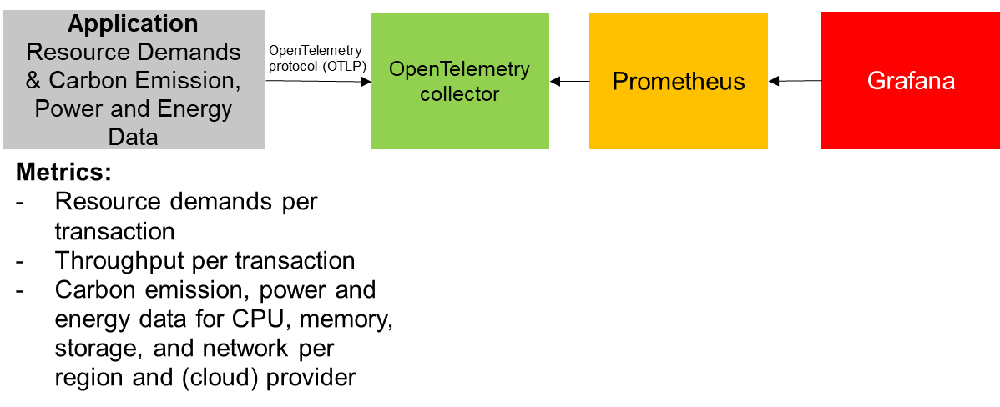

To see the extension in action for a very simple java application we will create the setup depicted in the following image. We will setup an Application that will be instrumented using the OpenTelemetry Java-Agent including our extension. This application will publish resource demand and carbon emission metrics. These metrics will be received by an OpenTelemetry collector which transforms the metrics into a format compatible to Prometheus. Prometheus will fetch the metrics from the collector and store them. Using Grafana, the metrics will be visualized in a preconfigured dashboard.

## Please note before you start with the JDK8 sample application:

1. You need to build the whole project before you continue, for details on how to build the project, take a look at the top level [README.md](../../README.md#building-the-project).
2. Afterwards, you need to start OpenTelemetry compatible tracing and metrics backends as explained in the [examples README.md](../README.md#starting-opentelemetry-backends-for-the-example-applications)




Once the preconditions ([building the project and starting the OpenTelemetry backends](#please-note-before-you-start-with-the-jdk8-sample-application))are completed, the sample Application can be started with the OpenTelemetry Java agent attached from the current directory as follows.
```bash
java -javaagent:./target/jib/opentelemetry-javaagent-all.jar \
-Dotel.service.name=sampleapplication \
-Dotel.logs.exporter=logging \
-Dotel.javaagent.extensions=./target/jib/io.retit.opentelemetry.javaagent.extension.jar \
-Dio.retit.emissions.cloud.provider=aws \
-Dio.retit.emissions.cloud.provider.region=af-south-1 \
-Dio.retit.emissions.cloud.provider.instance.type=a1.medium \
-DRUN_MODE=continuously \
-jar ./examples/simple-jdk8-application/target/simple-jdk8-application.jar
```

This application will run until you stop it and generate data. While it is generating data, you can look at the data in the backends. The easiest way is to check out the [Grafana dashboard](http://localhost:3000/grafana/dashboards) here:

    http://localhost:3000/grafana/dashboards

After some time you can see the data produced by this application in the following dashboard. As an example the CPU and memory demands are shown as they are supported on most plattforms as well as the Emission Calculation Factors. Furthermore, we have integrated a [Software Carbon Intensity](https://sci.greensoftware.foundation/) calculation for each transaction based on this data. This calculation is based on our work presented at the [Symposium on Software Performance 2024](https://fb-swt.gi.de/fileadmin/FB/SWT/Softwaretechnik-Trends/Verzeichnis/Band_44_Heft_4/SSP24_16_camera-ready_5255.pdf).

